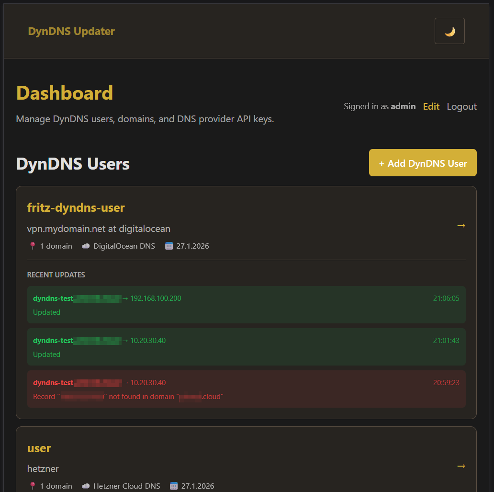
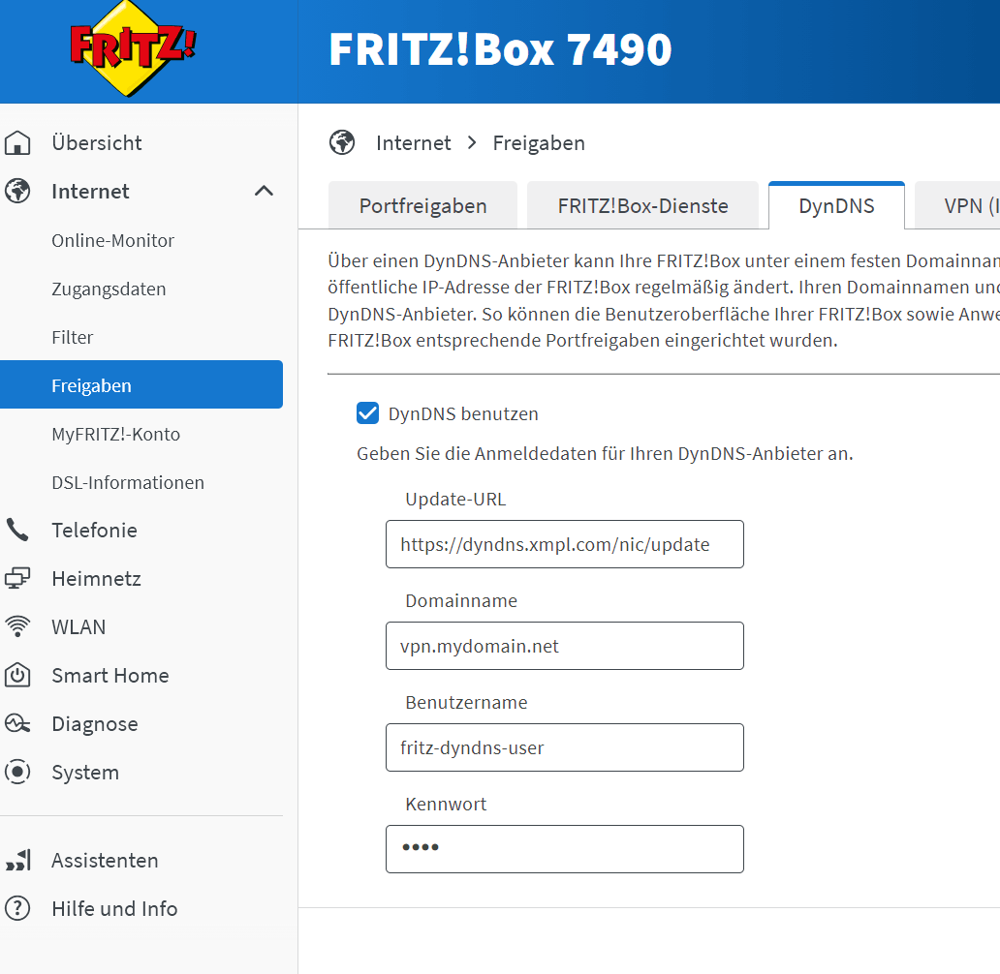

# <center>DynDNS Updater middleware</center>

Self-hosted Dynamic DNS manager with support for multiple DNS providers.

## Supported Providers

- **Hetzner Cloud DNS** - Zones + records management
- **DigitalOcean DNS** - Domain + records management

Easily extensible: add new providers by creating a new module in `lib/providers/`.

## Features

- Single Astro SSR app with SQLite storage (WAL) and Redis for sessions
- Management GUI (create first admin, login, manage DynDNS users with provider selection, API keys and domains)
- DynDNS endpoint with Basic Auth (`/nic/update`), standard `hostname` and `myip` params
- Multi-provider DNS API integration - auto-resolves zone/domain + record name from FQDN
- Provider-agnostic architecture for easy extensibility

<center></center>

## Project Structure

```
.
├─ frontend/                # Astro SSR app (server mode)
│  ├─ src/
│  │  ├─ pages/
│  │  │  ├─ index.astro     # Login / setup redirect
│  │  │  ├─ setup.astro     # First admin setup
│  │  │  ├─ dashboard.astro # Admin dashboard + recent logs
│  │  │  ├─ nic/update.ts   # DynDNS update endpoint (GET)
│  │  │  └─ users/          # DynDNS user CRUD + domain linking
│  │  └─ lib/               # db, auth, session, hetzner client
│  ├─ astro.config.mjs      # Node adapter (standalone)
│  ├─ Dockerfile            # Production image
│  └─ package.json
├─ docker-compose.yml       # Redis + app + Caddy
├─ Caddyfile                # Reverse proxy + TLS
└─ README.md
```

## Local Development

Prereqs: Node 20+, npm

```bash
cd frontend
npm install
npm run dev
# http://localhost:4321
```

On first run, you’ll be redirected to `/setup` to create the initial admin.

If you want to use Redis locally, you can use docker-compose.dev.yml to spin up Redis first.

```bash
docker compose -f docker-compose.dev.yml up -d
```

## DynDNS Endpoint

- Update all domains (IP auto-detect):
   - `GET /nic/update`
- Update all domains with explicit IP:
   - `GET /nic/update?myip=1.2.3.4`
- Update specific hostname:
   - `GET /nic/update?hostname=dyndns.example.com&myip=1.2.3.4`

Auth: HTTP Basic Auth (username/password you created in the GUI)

Use this endpoint in your internet router, such as a FRITZ!Box (example router):

<center></center>

## Production

### Prerequisites
- Docker and Docker Compose installed
- **For public servers**: A domain name pointing to your server's public IP
- **For local networks**: Just use HTTP on port 80

### Configure

Create a `.env` file next to `docker-compose.yml`:

**Option 1: Public Server with Domain (HTTPS with automatic SSL)**
```
DOMAIN_DYNDNS_UPDATER=dyndns.example.com
```
This will automatically provision SSL certificates via Let's Encrypt and serve over HTTPS on ports 80/443.

**Option 2: Local Network Access (HTTP without SSL)**
```
DOMAIN_DYNDNS_UPDATER=:80
```
Perfect for running on a local machine, Raspberry Pi, or home server behind a router. Access the service via your local IP address (e.g., `http://192.168.1.100`) without SSL encryption.

### Build and Run
```bash
# from repo root
docker compose -f docker-compose.yml up -d --build
```

**Access the service:**
- With domain (Option 1): `https://dyndns.example.com/`
- Local network (Option 2): `http://192.168.1.100/` (replace with your local IP)

**DynDNS endpoint:**
- With domain: `https://dyndns.example.com/nic/update`
- Local network: `http://192.168.1.100/nic/update`

### First-Time Setup
- Open the site and complete `/setup` to create the first admin

### Add a DynDNS User, choose a Provider, add Domain(s)
- In the GUI, create a DynDNS user/password which is used for Basic Auth to access the DynDNS Endpoint `/nic/update`
- Choose from the available provider list and add your API key / Token
- Add a domain (FQDN) and initial IP; zone and record name auto-resolve via the providers' API

### Update Examples
- Curl (Linux/macOS):
  - All domains, IP auto-detect:
    ```
    curl -u user:pass https://$DOMAIN_DYNDNS_UPDATER/nic/update
    ```
  - Specific hostname with IP:
    ```
    curl -u user:pass "https://$DOMAIN_DYNDNS_UPDATER/nic/update?hostname=host.example.com&myip=1.2.3.4"
    ```
- PowerShell (Windows):
  ```
  $pair = "user:pass"
  $b64 = [Convert]::ToBase64String([Text.Encoding]::ASCII.GetBytes($pair))
  Invoke-WebRequest -Uri "https://$DOMAIN_DYNDNS_UPDATER/nic/update?myip=1.2.3.4" -Headers @{ Authorization = "Basic $b64" }
  ```

### Notes
- Recent updates appear on the dashboard (last 5 per user)
- Updater is currently supporting only IPv4 A-record
- You already need to have a zone/domain name at one of the supported providers to modify them
- Subdomains will be created automatically if they do not already exist in the zone
- If you delete a user, the corresponding subdomains or zones will not be deleted/touched

## Security
- Secrets: Provider API keys per DynDNS user via the GUI
- Reverse proxy (Caddy) auto-provisions TLS (Let's Encrypt)
- Data persists locally in `./frontend/data/dyndns.db` (SQLite)